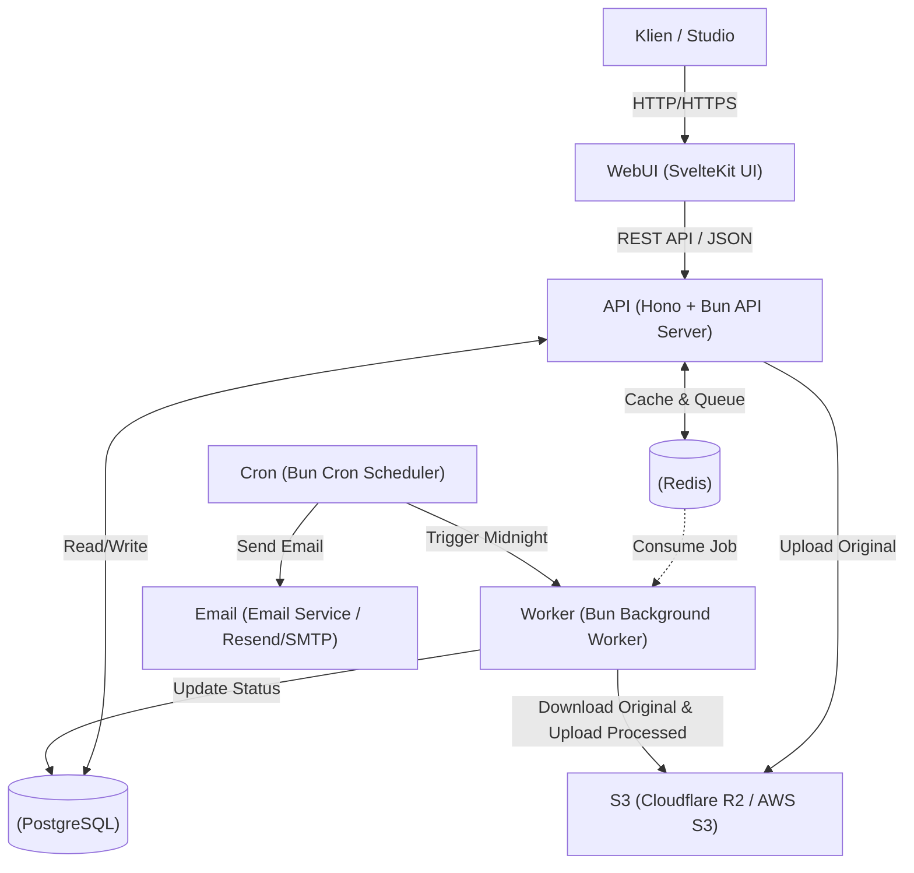

# **Kirim Karya | High-Level Design (HLD): Platform Manajemen Galeri & Client Proofing**

## **1\. Pendahuluan**
Dokumen ini menguraikan arsitektur tingkat tinggi (High-Level Design) untuk SaaS Manajemen Galeri dan *Client Proofing*. Platform ini dirancang bagi studio kreatif (fotografer/videografer) untuk mengelola proyek klien, mendistribusikan foto dengan aman, serta memfasilitasi proses pemilihan (*proofing*) dan pemberian *feedback* secara efisien.

## **2\. Tech Stack Utama**

* **Frontend / UI:** SvelteKit (SSR & CSR)
* **Backend API & Web Server:** Hono berjalan di *runtime* Bun
* **Database & ORM:** PostgreSQL dengan Drizzle ORM
* **Caching & Message Queue:** Redis
* **Auth:** Better Auth
* **Object Storage:** Cloudflare R2 / AWS S3
* **Image Processing:** sharp (via Bun)

## **3\. Arsitektur Sistem**

Arsitektur ini memisahkan antara *Main API Server* yang melayani permintaan HTTP secara *real-time* dan *Background Worker* yang menangani tugas-tugas berat untuk memastikan API tetap responsif.

## **4\. Alur Kerja Sistem (Data Flow)**

### **4.1. Alur Upload Foto & Background Processing**

1. **Upload Request:** Pengguna (Studio) mengunggah foto beresolusi tinggi melalui *dashboard* SvelteKit.
2. **Streaming to Storage:** Hono API menerima *stream* file dan langsung meneruskannya (*pipe*) ke Object Storage (S3/R2) untuk menghemat RAM *server*.
3. **Queueing:** Setelah file mentah tersimpan, Hono memasukkan ID Foto dan path S3 ke dalam antrean Redis (contoh: menggunakan pola *Producer-Consumer*). Hono langsung merespons "Upload Sukses (Processing)" ke klien.
4. **Worker Processing:** Bun Worker secara asinkron mengambil antrean dari Redis. Worker mengunduh foto mentah ke memori, menggunakan sharp untuk:
    * Membuat *Thumbnail* (versi resolusi rendah).
    * Menambahkan *Watermark* pada foto tampilan.
5. **Save & Notify:** Worker mengunggah versi *thumbnail* dan *watermark* ke S3, mengupdate status foto di PostgreSQL menjadi "Ready", dan memperbarui *cache* galeri di Redis.

### **4.2. Alur Akses Galeri Klien (Share Link & Caching Strategy)**

1. **Share Link Generation:** Studio men-*generate* tautan berbagi (*share link*) unik untuk galeri layaknya Google Drive. Tautan ini dikirim ke Klien dan dapat dilindungi oleh *password* atau batas waktu tayang.
2. **Access Request:** Klien membuka *share link* galeri tersebut.
2. **Cache Check:** Hono API akan mengecek *cache* di Redis (GET gallery:{id}:metadata).
3. **Cache Hit/Miss:**
    * **Hit:** Jika data ada, Hono langsung mengembalikan daftar URL foto (S3 Presigned URLs) ke SvelteKit dalam hitungan milidetik.
    * **Miss:** Jika data tidak ada (karena belum di-*cache* atau *expired*), Hono melakukan *query* ke PostgreSQL, menghasilkan *Presigned URLs*, menyimpan hasilnya ke Redis (SETEX dengan TTL 1 jam), lalu mengembalikan respons.

### **4.3. Alur Cron Job (Scheduled Tasks)**

Bun mengeksekusi *script* penjadwalan secara terpisah (bisa menggunakan *node-cron* atau *cron* bawaan OS yang memanggil *script* Bun).

* **Eksekusi Pukul 00:00:**
    1. Melakukan *query* ke PostgreSQL untuk mencari galeri yang expired\_at \= Hari Ini \+ 1 Hari.
    2. Memicu layanan Email untuk mengirim *reminder* ke Klien dan Studio.
    3. Melakukan *query* untuk mencari galeri yang masa aktifnya sudah habis hari ini.
    4. Menghapus data *records* foto dari PostgreSQL.
    5. Mengirimkan instruksi DeleteObjects ke S3/R2 untuk menghapus file fisik secara permanen (menghemat biaya *storage*).

## **5\. Autentikasi & Kontrol Akses (Better Auth)**

Platform tidak membangun otentikasi dari nol: seluruh flow login dan session dikelola oleh Better Auth, yang merupakan framework otentikasi agnostik terhadap stack dan sudah menyediakan fitur email/password, OAuth, plugin, serta dukungan untuk SvelteKit dan Hono tanpa menulis ulang mekanisme sesi dasar.citeturn0search7

1. **Integrasi Better Auth Core & Social Login:** Backend (Hono) memanggil `betterAuth` untuk proses autentikasi. Metode login utama difokuskan pada **Google Login / Register** (via `socialProviders`), selain login kredensial bawaan. Better Auth memvalidasi autentikasi, membuat session, dan mengeluarkan token yang dikirim ke SvelteKit. Token ini diteruskan sebagai cookie HTTP-only atau header Bearer, sedangkan SvelteKit memanfaatkan SDK Better Auth untuk otentikasi sisi klien sehingga kita tidak perlu menyimpan password di aplikasi.
2. **Plugin Lanjutan:** Kami mengaktifkan plugin `passkey()`, `twoFactor()`, serta plugin organisasi/tenant (agar studio, klien, dan subcontractor terpisah). Klien yang diundang via *share link* bisa langsung mengakses tanpa login kompleks.
3. **Infrastruktur & Keamanan Operasional:** Better Auth Infrastructure menyediakan dashboard manajemen user/org, audit log, abuse protection (anti credential stuffing, disposable email, impossible travel), serta transactional messaging (email/SMS) untuk verifikasi dan 2FA tanpa membangun layanan sendiri.citeturn0search3
4. **Akses API Post-login:** Setelah session diterbitkan, Hono memanggil `auth.api.requireSession` untuk setiap route yang membutuhkan akses gallery dan memetakan ID tenant ke record di PostgreSQL, Redis cache, dan S3. SvelteKit cukup menyertakan token session agar hooks `load` dapat mengambil metadata galeri. Better Auth menyimpan sesi di Redis atau database pilihan kami sehingga kita bisa menghapus sesi (e.g., logout) tanpa mencabut data pengguna utama.citeturn0search5

## **6\. Skema Database Sederhana (PostgreSQL)**

* **users** (Studio/Tenant)
    * id, email, password\_hash, studio\_name, subscription\_tier
* **galleries**
    * id, user\_id, title, client\_email, password\_hash, status, expires\_at, created\_at
* **photos**
    * id, gallery\_id, original\_s3\_key, thumbnail\_s3\_key, watermarked\_s3\_key, status (PENDING, READY, ERROR)
* **feedbacks** (Client Proofing)
    * id, photo\_id, is\_selected (boolean), comment, created\_at

## **7\. Advanced Backend Implementations Highlights**

1. **Non-blocking API (Hono \+ Bun):** Memanfaatkan performa I/O Bun yang sangat cepat. Proses manipulasi gambar yang memakan banyak CPU *cycle* dipisahkan ke *worker thread* / *process* tersendiri agar *Event Loop* utama Hono tidak terblokir.
2. **Cache Invalidation:** Setiap kali ada interaksi baru (misal: Studio menambah foto baru ke galeri), Hono API secara eksplisit menghapus kunci Redis (DEL gallery:{id}:metadata) (*Cache Invalidation*), sehingga klien berikutnya akan mendapatkan data *fresh* dari *database*.
3. **Idempotent Background Jobs:** Jika *worker* gagal di tengah proses *watermarking* (misal *server restart*), antrean di Redis dikonfigurasi dengan *retry mechanism*. *Worker* dirancang *idempotent* (mengulang proses yang sama tidak akan merusak status akhir).
4. **Streamlined Storage:** File mentah klien tidak pernah disimpan di disk lokal VPS. Hono melakukan *proxy-streaming* dari HTTP Request langsung ke S3 Client untuk menjaga *footprint* memori tetap rendah.
