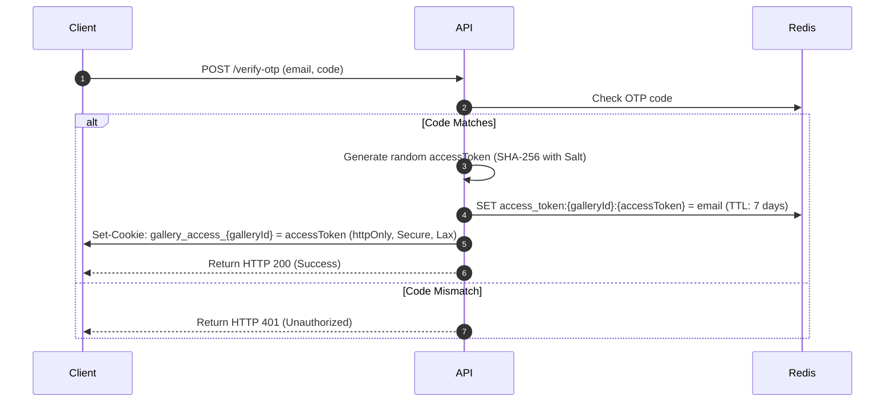

# Design Specification: Enterprise-Grade Security & Backend Hardening

This document details the architectural design and implementation plan for securing the client proofing flow, image proxy, and database mutations in KirimKarya.

## 1. Objectives & Scope

- **Close Image Proxy Authorization Bypass (BOLA)**: Prevent unauthorized access to private gallery previews, thumbnails, and watermarks by strictly validating S3 path keys and verifying client access tokens in Redis.
- **Implement Server-Side Client Sessions**: Replace raw email storage in cookies with secure, random session tokens mapping back to emails in Redis.
- **Prevent Brute-Force & Email Spam (Rate Limiting)**: Enforce Redis-backed rate limiting on sensitive routes (OTP generation, OTP verification, and static password verification).
- **Ensure Database Consistency (Transactions)**: Wrap bulk photo deletions and related multi-table updates in database transactions.

---

## 2. Detailed Architecture

### 2.1 Redis-Backed Session Lifecycle

Instead of storing raw emails (PII) inside browser cookies, KirimKarya will use server-side sessions stored in Redis.



#### Resolution Helper
When any client-authenticated endpoint is hit, a session resolution helper checks the token:
- Key: `access_token:${galleryId}:${accessToken}`
- Returns: `email` (if found/valid) or `null` (if expired or invalid).

This helper will be used in:
- [public.controller.ts](file:///home/agprastyo/Developments/KirimKarya/apps/api/src/modules/public/public.controller.ts)
- [images.controller.ts](file:///home/agprastyo/Developments/KirimKarya/apps/api/src/modules/images/images.controller.ts)

---

### 2.2 Redis-Backed Rate Limiting

To mitigate automated attacks, we enforce strict Redis rate limits on verification and OTP request routes in [public.service.ts](file:///home/agprastyo/Developments/KirimKarya/apps/api/src/modules/public/public.service.ts):

1. **OTP Request Rate Limit**:
   - Limit: Max 3 requests per 5 minutes per `galleryId` + `email`.
   - Redis Key: `ratelimit:request-otp:${galleryId}:${email}`
2. **OTP Verification Rate Limit**:
   - Limit: Max 5 attempts per 15 minutes per `galleryId` + `email`.
   - Redis Key: `ratelimit:otp:${galleryId}:${email}`
3. **Password Verification Rate Limit**:
   - Limit: Max 5 attempts per 15 minutes per `galleryId` + `email`.
   - Redis Key: `ratelimit:password:${galleryId}:${email}`

*On verification success, rate limit keys for the successful action are immediately deleted (`redis.del`).*

---

### 2.3 Image Proxy Security & Path Sanitization

The image proxy [images.controller.ts](file:///home/agprastyo/Developments/KirimKarya/apps/api/src/modules/images/images.controller.ts) acts as a gateway to private assets stored in S3/MinIO. We harden it as follows:

1. **Path Traversal Sanitization**:
   - Convert all backslashes `\` to slashes `/`.
   - Strip duplicate parent directory paths `..` to prevent traversal.
   - Instantly block requests containing `..` in the key with a `403 Forbidden`.
2. **Exact Public Path Checks**:
   - Use `startsWith("uploads/")` and `startsWith("avatar/")` rather than `includes()`.
3. **Redis Token Validation**:
   - Check if `gallery_access_${galleryId}` cookie exists.
   - Perform a quick lookup `await redis.get("access_token:" + galleryId + ":" + token)` to verify the token mapping.
4. **Scope Authorization**:
   - Unauthenticated clients (without active sessions) can never access folders outside `thumbs`, `previews`, and `watermarks`.
   - Access to raw original files (`/original/*`) is rejected with a `403 Forbidden` for guests.

---

### 2.4 Transactional Integrity

Multi-table writes must be completed inside an atomic database transaction.

- **Bulk Photo Deletion**:
  In [photos.controller.ts](file:///home/agprastyo/Developments/KirimKarya/apps/api/src/modules/photos/photos.controller.ts), wrapping the feedback deletions and photo deletions in a transaction:
  ```typescript
  await db.transaction(async (tx) => {
      await tx.delete(feedbacks).where(inArray(feedbacks.photoId, targetIds));
      await tx.delete(photos).where(inArray(photos.id, targetIds));
  });
  ```

---

## 3. Implementation Plan

1. **Redis Session Resolution & Token Matching**:
   - Implement token-to-email resolution in `publicService`.
   - Update `listPublicPhotosRoute`, `submitFeedbackRoute`, and `finalizeGallerySelectionRoute` to resolve the client email from the cookie value, falling back to the IP or anonymous ID only if the gallery is public.
2. **Image Proxy Token Verification**:
   - Update `images.controller.ts` to perform a Redis lookup on the session cookie value instead of checking its presence.
3. **Database Transactions**:
   - Apply `db.transaction()` wrapper to the bulk photo delete handler in `photos.controller.ts`.
4. **Verification & Logging**:
   - Clear Redis rate limits upon successful login.
   - Verify changes with integrated test cases.
